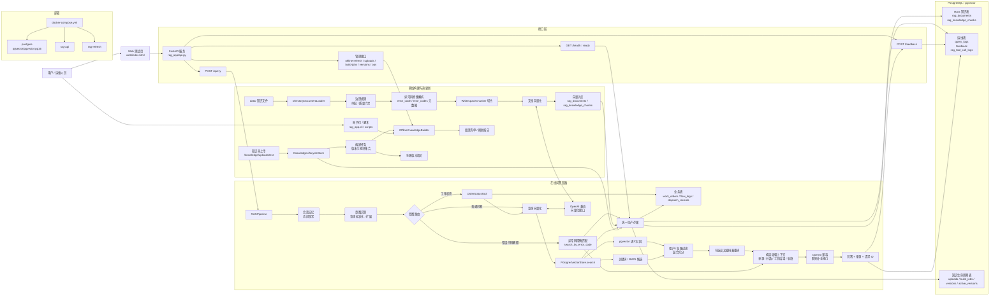

# 运维 RAG 架构图

```mermaid
flowchart LR
  user["用户 / 运维人员"] --> web["Web 测试页<br/>web/index.html"]
  user --> cli["命令行 / 脚本<br/>rag_app.cli / scripts"]
  web --> api["FastAPI 服务<br/>rag_app/api.py"]

  subgraph API["接口层"]
    api --> queryApi["POST /query"]
    api --> feedbackApi["POST /feedback"]
    api --> adminApi["管理接口<br/>offline-refresh / uploads / build-jobs / versions / ops"]
    api --> statusApi["GET /health / ready"]
  end

  subgraph Online["在线问答链路"]
    queryApi --> pipeline["RAGPipeline"]
    pipeline --> memory["会话记忆<br/>追问改写"]
    memory --> intent["意图识别<br/>查询标准化 / 扩展"]
    intent --> routeGate{"意图路由"}
    routeGate -->|错误代码解释| exactError["异常码精确匹配<br/>search_by_error_code"]
    routeGate -->|工单状态| orderTool["OrderStatusTool"]
    routeGate -->|普通问答| embedQuery["查询向量化"]
    orderTool --> bizTables["业务表<br/>work_orders / flow_logs / dispatch_records"]
    orderTool --> embedQuery
    exactError --> pg

    embedQuery <--> embeddingApi["OpenAI 兼容<br/>向量化接口"]
    embedQuery --> vectorSearch["PostgresVectorStore.search"]
    vectorSearch --> semantic["pgvector 语义召回"]
    vectorSearch --> keyword["关键词 / BM25 候选"]
    semantic --> authRank["租户 / 权限过滤<br/>混合打分"]
    keyword --> authRank
    authRank --> rerank["可选交叉编码器重排"]
    rerank --> context["构造增强上下文<br/>来源 / 分数 / 工具结果 / 轨迹"]
    exactError --> context
    context --> llm["OpenAI 兼容<br/>聊天补全接口"]
    llm --> answer["回答 + 来源 + 请求 ID"]
    answer --> feedbackApi
  end

  subgraph Offline["离线构建与热更新"]
    data["data/ 知识文件"] --> loader["DirectoryDocumentLoader"]
    upload["知识热上传<br/>/knowledge/uploads/text"] --> lifecycle["KnowledgeLifecycleStore"]
    lifecycle --> buildJob["构建任务<br/>版本化知识集合"]
    buildJob --> builder["OfflineKnowledgeBuilder"]
    cli --> builder
    adminApi --> builder
    loader --> governance["治理规则<br/>审批 / 质量门禁"]
    governance --> errorMeta["异常码特殊解析<br/>error_code / error_codes 元数据"]
    errorMeta --> chunker["WhitespaceChunker 切片"]
    chunker --> docEmbed["文档向量化"]
    docEmbed <--> embeddingApi
    docEmbed --> upsert["向量入库<br/>rag_documents / rag_knowledge_chunks"]
    builder --> manifest["处理清单 / 刷新报告"]
    buildJob --> activePtr["生效版本指针"]
  end

  subgraph Store["PostgreSQL / pgvector"]
    pg["统一生产存储"]
    pg --> ragTables["RAG 知识表<br/>rag_documents<br/>rag_knowledge_chunks"]
    pg --> opsTables["运维表<br/>query_logs<br/>feedback<br/>rag_tool_call_logs"]
    pg --> versionTables["知识生命周期表<br/>uploads / build_jobs / versions / active_versions"]
    pg --> bizTables
  end

  upsert --> pg
  vectorSearch --> pg
  lifecycle --> pg
  feedbackApi --> opsTables
  statusApi --> pg
  answer --> opsTables

  subgraph Deploy["部署"]
    compose["docker-compose.yml"]
    compose --> pgService["postgres<br/>pgvector/pgvector:pg16"]
    compose --> apiService["rag-api"]
    compose --> refreshService["rag-refresh"]
  end
```
