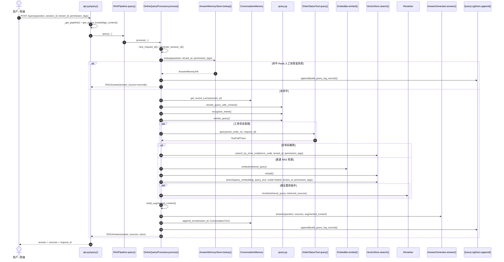
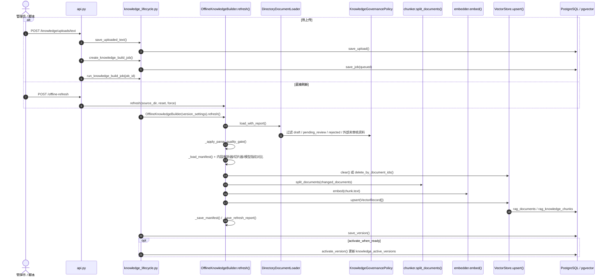
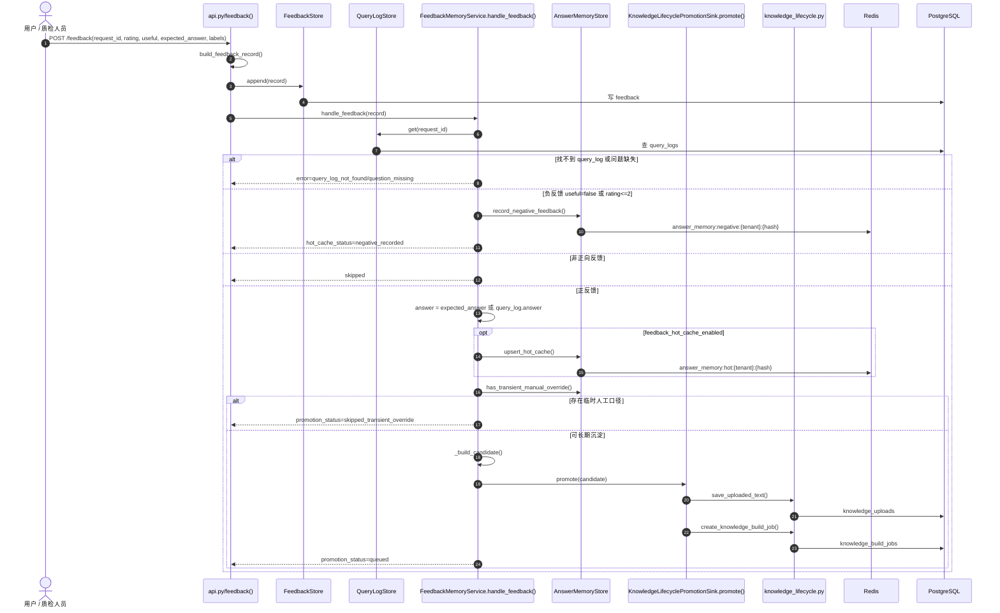

# 运维 RAG 架构图

这张图按当前代码里的真实链路画：离线知识生产、在线问答、反馈/记忆沉淀三条链路共用 PostgreSQL/pgvector、Redis 和 OpenAI 兼容模型服务。

## 总体架构

```mermaid
flowchart LR
  user["用户 / 运维人员"] --> web["Web 测试页<br/>web/index.html"]
  user --> cli["CLI / 脚本<br/>rag_app.cli<br/>scripts/*.ps1"]
  web --> api["FastAPI<br/>rag_app/api.py"]
  cli --> api

  subgraph API["接口层：rag_app/api.py"]
    health["GET /health /ready<br/>health()<br/>ready()"]
    queryApi["POST /query<br/>query()"]
    streamApi["POST /query/stream<br/>query_stream()"]
    feedbackApi["POST /feedback<br/>feedback()"]
    offlineApi["POST /offline-refresh<br/>offline_refresh()"]
    uploadApi["POST /knowledge/uploads/text<br/>upload_knowledge_text()"]
    buildApi["POST /knowledge/build-jobs<br/>create_knowledge_job()"]
    versionApi["知识版本接口<br/>activate_knowledge_version()<br/>rollback_knowledge_version()"]
    overrideApi["Redis 快答接口<br/>create_memory_override()<br/>patch_memory_override()<br/>delete_memory_override()"]
    opsApi["运维排查接口<br/>query_logs()<br/>feedback_logs()<br/>ops_summary()<br/>ops_trace()"]
  end

  api --> health
  api --> queryApi
  api --> streamApi
  api --> feedbackApi
  api --> offlineApi
  api --> uploadApi
  api --> buildApi
  api --> versionApi
  api --> overrideApi
  api --> opsApi

  subgraph Online["在线问答链路"]
    getPipe["_get_pipeline()<br/>读取 active knowledge + 缓存 RAGPipeline"]
    pipeline["RAGPipeline<br/>query()<br/>stream_query()"]
    processor["OnlineQueryProcessor<br/>process()<br/>stream_process()"]
    answerLookup["AnswerMemoryStore.lookup()<br/>Redis manual override<br/>Redis hot cache"]
    dialogue["ConversationMemory<br/>get_recent_turns()<br/>append_turn()<br/>generate_session_id()"]
    intent["查询理解<br/>recognize_intent()<br/>rewrite_query_with_context()<br/>rewrite_query()"]
    exact["异常码直达<br/>_process_exact_error_code()<br/>VectorStore.search_by_error_code()"]
    tool["业务工具<br/>_maybe_call_order_status_tool()<br/>OrderStatusTool.query()"]
    embedQuery["查询向量化<br/>_embed_query()<br/>Embedder.embed()"]
    search["混合检索<br/>VectorStore.reload()<br/>VectorStore.search()"]
    rerank["可选重排<br/>reranker.rerank()<br/>_precheck_rerank_skip_reason()"]
    context["增强上下文<br/>build_augmented_context()"]
    generate["答案生成<br/>AnswerGenerator.answer()"]
    qlog["查询日志<br/>build_query_log_record()<br/>QueryLogStore.append()"]
  end

  queryApi --> getPipe --> pipeline --> processor
  streamApi --> getPipe
  processor --> answerLookup
  answerLookup -->|命中| qlog
  answerLookup -->|未命中| dialogue --> intent
  intent --> exact
  intent --> tool
  intent --> embedQuery --> search --> rerank --> context --> generate --> dialogue
  exact --> context
  tool --> context
  generate --> qlog

  subgraph Offline["离线知识生产与热更新链路"]
    uploadText["save_uploaded_text()<br/>保存热上传文本"]
    createJob["create_knowledge_build_job()<br/>创建版本化构建任务"]
    runJob["run_knowledge_build_job()<br/>独立 collection 构建<br/>成功后可切 active 指针"]
    activeCtx["get_active_knowledge_context()<br/>返回在线查询应读的 collection"]
    builder["OfflineKnowledgeBuilder.refresh()"]
    loader["DirectoryDocumentLoader.load_with_report()<br/>读取 data/ 或构建源目录"]
    governance["KnowledgeGovernancePolicy<br/>审批 / 草稿 / 外部资料过滤"]
    quality["_apply_parse_quality_gate()<br/>解析质量门禁"]
    manifest["_load_manifest()<br/>content_hash / parser / chunker / embedding 对比"]
    chunk["chunker.split_documents()"]
    embedDoc["embedder.embed(chunk.text)"]
    upsert["VectorStore.upsert()<br/>写 rag_documents / rag_knowledge_chunks"]
    saveManifest["_save_manifest()<br/>_save_refresh_report()"]
  end

  uploadApi --> uploadText --> createJob
  buildApi --> createJob --> runJob
  versionApi --> activeCtx
  offlineApi --> builder
  runJob --> builder
  builder --> loader --> governance --> quality --> manifest --> chunk --> embedDoc --> upsert --> saveManifest

  subgraph Feedback["反馈 / 记忆沉淀链路"]
    buildFeedback["build_feedback_record()"]
    saveFeedback["FeedbackStore.append()<br/>先写 feedback"]
    handleFeedback["FeedbackMemoryService.handle_feedback()"]
    getQueryLog["QueryLogStore.get(request_id)<br/>找回原始问答现场"]
    neg["_is_negative_feedback()<br/>record_negative_feedback()"]
    pos["_is_positive_feedback()<br/>expected_answer 优先"]
    hot["AnswerMemoryStore.upsert_hot_cache()<br/>写 Redis 自动热答"]
    transient["has_transient_manual_override()<br/>临时口径不沉淀长期知识"]
    candidate["_build_candidate()<br/>生成 feedback_promotion Markdown"]
    promote["KnowledgeLifecyclePromotionSink.promote()<br/>save_uploaded_text()<br/>create_knowledge_build_job()"]
  end

  feedbackApi --> buildFeedback --> saveFeedback --> handleFeedback --> getQueryLog
  getQueryLog --> neg
  getQueryLog --> pos --> hot --> transient --> candidate --> promote --> createJob

  subgraph Redis["Redis"]
    redisSession["会话短期记忆<br/>session_id -> recent turns<br/>TTL"]
    redisManual["人工快答<br/>key: answer_memory:manual:{tenant}:{hash}"]
    redisHot["自动热答<br/>key: answer_memory:hot:{tenant}:{hash}"]
    redisNegative["负反馈统计<br/>key: answer_memory:negative:{tenant}:{hash}"]
  end

  subgraph PG["PostgreSQL / pgvector"]
    ragDocs["rag_documents"]
    ragChunks["rag_knowledge_chunks<br/>chunk_text + metadata + vector(1024)"]
    lifecycleTables["knowledge_uploads<br/>knowledge_build_jobs<br/>knowledge_versions<br/>knowledge_active_versions"]
    opsTables["query_logs<br/>feedback<br/>rag_tool_call_logs"]
    bizTables["业务表<br/>work_orders<br/>flow_logs<br/>dispatch_records"]
  end

  subgraph Model["OpenAI 兼容模型服务"]
    embSvc["Embedding API<br/>text-embedding-v4 等"]
    chatSvc["Chat Completion API<br/>qwen-plus 等"]
  end

  answerLookup --> redisManual
  answerLookup --> redisHot
  dialogue --> redisSession
  hot --> redisHot
  neg --> redisNegative
  overrideApi --> redisManual

  upsert --> ragDocs
  upsert --> ragChunks
  search --> ragChunks
  exact --> ragChunks
  tool --> bizTables
  qlog --> opsTables
  saveFeedback --> opsTables
  createJob --> lifecycleTables
  runJob --> lifecycleTables
  activeCtx --> lifecycleTables
  opsApi --> opsTables
  health --> ragChunks

  embedQuery --> embSvc
  embedDoc --> embSvc
  generate --> chatSvc
```

## 在线问答主链路

## 离线构建与知识版本链路

## 反馈与记忆沉淀链路

## 重点方法速查

| 链路 | 文件 | 重点方法 / 类 | 作用 |
| --- | --- | --- | --- |
| API 入口 | `rag_app/api.py` | `query()` / `query_stream()` | 在线问答入口 |
| API 入口 | `rag_app/api.py` | `feedback()` | 反馈入口，先写反馈，再触发记忆沉淀 |
| API 入口 | `rag_app/api.py` | `_get_pipeline()` | 读取 active knowledge，上下文变化时重建 `RAGPipeline` |
| 在线编排 | `rag_app/rag.py` | `RAGPipeline.query()` / `stream_query()` | 把 API 请求交给在线处理器 |
| 在线处理 | `rag_app/retrieval/online.py` | `OnlineQueryProcessor.process()` | 在线主流程：快答、会话、意图、检索、生成、日志 |
| Redis 快答 | `rag_app/retrieval/answer_memory.py` | `AnswerMemoryStore.lookup()` | 查询人工 override 和自动 hot cache |
| 查询理解 | `rag_app/retrieval/query.py` | `recognize_intent()` / `rewrite_query()` | 意图识别、查询标准化和扩写 |
| 多轮记忆 | `rag_app/retrieval/dialogue.py` | `generate_session_id()` / `get_recent_turns()` / `append_turn()` | 会话短期记忆和追问改写 |
| 业务工具 | `rag_app/tools/order_status.py` | `OrderStatusTool.query()` | 工单状态实时查询 |
| 向量检索 | `rag_app/indexing/vector_store.py` | `PostgresVectorStore.search()` | pgvector + BM25 混合检索、权限过滤、阈值过滤 |
| 异常码检索 | `rag_app/indexing/vector_store.py` | `search_by_error_code()` | 异常码精确召回 |
| 上下文组装 | `rag_app/retrieval/online.py` | `build_augmented_context()` | 拼接用户问题、召回来源、工具结果、会话历史 |
| 离线构建 | `rag_app/indexing/offline.py` | `OfflineKnowledgeBuilder.refresh()` | 文档治理、增量判断、切片、向量化、入库 |
| 知识生命周期 | `rag_app/operations/knowledge_lifecycle.py` | `save_uploaded_text()` | 热上传文本落盘并记录 |
| 知识生命周期 | `rag_app/operations/knowledge_lifecycle.py` | `create_knowledge_build_job()` / `run_knowledge_build_job()` | 创建并执行版本化知识构建 |
| 知识生命周期 | `rag_app/operations/knowledge_lifecycle.py` | `get_active_knowledge_context()` | 在线链路读取当前生效知识集合 |
| 反馈沉淀 | `rag_app/operations/feedback_memory.py` | `FeedbackMemoryService.handle_feedback()` | 判断正负反馈，写 Redis 热答或生成长期知识候选 |
| 反馈沉淀 | `rag_app/operations/feedback_memory.py` | `_build_candidate()` | 把高价值反馈转成 `feedback_promotion` Markdown |
| 运维追踪 | `rag_app/operations/ops.py` | `build_query_log_record()` / `build_feedback_record()` / `build_request_trace()` | 查询日志、反馈记录和 request_id 追踪 |
