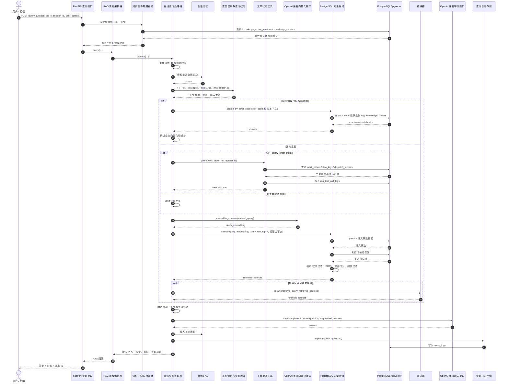
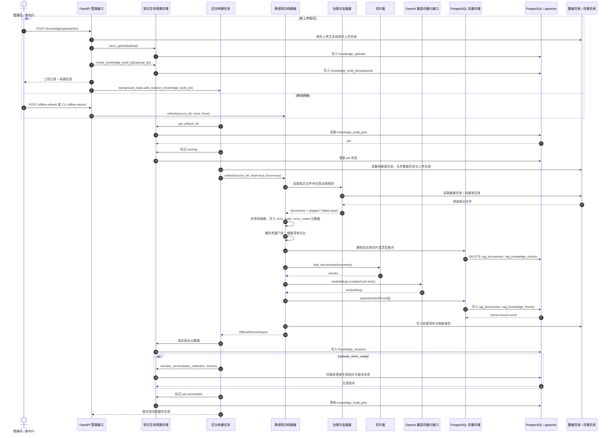

# 运维 RAG 时序图

## 在线问答链路

```mermaid
sequenceDiagram
  autonumber
  actor U as 用户 / 前端
  participant API as FastAPI 查询接口
  participant P as RAG 流程编排器
  participant K as 知识生命周期存储
  participant O as 在线查询处理器
  participant M as 会话记忆
  participant Q as 意图识别与查询改写
  participant T as 工单状态工具
  participant E as OpenAI 兼容向量化接口
  participant V as PostgreSQL 向量存储
  participant DB as PostgreSQL / pgvector
  participant R as 重排器
  participant L as OpenAI 兼容聊天接口
  participant LOG as 查询日志存储

  U->>API: POST /query(question, top_k, session_id, user_context)
  API->>K: 读取生效知识库上下文
  K->>DB: 查询 knowledge_active_versions / knowledge_versions
  DB-->>K: 生效集合或基础集合
  K-->>API: 返回在线知识库配置
  API->>P: query(...)
  P->>O: process(...)

  O->>O: 生成请求 ID 与创建时间
  O->>M: 读取最近会话轮次
  M-->>O: history
  O->>Q: 归一化、追问改写、意图识别、检索查询扩展
  Q-->>O: 上下文查询、意图、检索查询

  alt 命中错误代码解释意图
    O->>V: search_by_error_code(error_code, 权限上下文)
    V->>DB: 按 error_code 精确查询 rag_knowledge_chunks
    DB-->>V: exact matched chunks
    V-->>O: sources
    O->>O: 跳过查询向量化和重排
  else 其他意图
    alt 命中 query_order_status
      O->>T: query(work_order_no, request_id)
      T->>DB: 查询 work_orders / flow_logs / dispatch_records
      DB-->>T: 工单状态与流转记录
      T->>DB: 写入 rag_tool_call_logs
      T-->>O: ToolCallTrace
    else 非工单状态意图
      O->>O: 跳过业务工具
    end

    O->>E: embeddings.create(retrieval_query)
    E-->>O: query_embedding
    O->>V: search(query_embedding, query_text, top_k, 权限上下文)
    V->>DB: pgvector 语义候选召回
    DB-->>V: 语义候选
    V->>DB: 关键词候选召回
    DB-->>V: 关键词候选
    V->>V: 租户/权限过滤、BM25、混合打分、阈值过滤
    V-->>O: retrieved_sources

    opt 启用且满足触发条件
      O->>R: rerank(retrieval_query, retrieved_sources)
      R-->>O: reranked sources
    end
  end

  O->>O: 构造增强上下文与处理轨迹
  O->>L: chat.completions.create(question, augmented_context)
  L-->>O: answer
  O->>M: 写入本轮摘要
  O->>LOG: append(QueryLogRecord)
  LOG->>DB: 写入 query_logs
  O-->>P: RAG 回答（答案、来源、处理轨迹）
  P-->>API: RAG 回答
  API-->>U: 答案 + 来源 + 请求 ID
```

## 知识上传、构建与激活链路

```mermaid
sequenceDiagram
  autonumber
  actor A as 管理员 / 命令行
  participant API as FastAPI 管理接口
  participant LS as 知识生命周期存储
  participant JOB as 后台构建任务
  participant B as 离线知识构建器
  participant G as 治理与加载器
  participant C as 切片器
  participant E as OpenAI 兼容向量化接口
  participant V as PostgreSQL 向量存储
  participant DB as PostgreSQL / pgvector
  participant FS as 数据目录 / 存储目录

  alt 热上传知识
    A->>API: POST /knowledge/uploads/text
    API->>FS: 保存上传文本到知识上传目录
    API->>LS: save_upload(upload)
    LS->>DB: 写入 knowledge_uploads
    API->>LS: create_knowledge_build_job(upload_ids)
    LS->>DB: 写入 knowledge_build_jobs(queued)
    API-->>A: 上传记录 + 构建任务
    API->>JOB: background_tasks.add_task(run_knowledge_build_job)
  else 离线刷新
    A->>API: POST /offline-refresh 或 CLI offline-refresh
    API->>B: refresh(source_dir, reset, force)
  end

  JOB->>LS: get_job(job_id)
  LS->>DB: 读取 knowledge_build_jobs
  DB-->>LS: job
  JOB->>LS: 标记 running
  LS->>DB: 更新 job 状态
  JOB->>FS: 准备构建源目录，合并数据目录与上传目录
  JOB->>B: refresh(source_dir, reset=true, force=true)

  B->>G: 加载知识文件并应用治理规则
  G->>FS: 读取数据目录 / 构建源目录
  FS-->>G: 原始知识文件
  G-->>B: documents + skipped / failed report
  B->>B: 异常码抽取，写入 error_code / error_codes 元数据
  B->>B: 解析质量门禁、增量清单对比
  B->>V: 删除旧文档切片或清空集合
  V->>DB: DELETE rag_documents / rag_knowledge_chunks
  B->>C: split_documents(documents)
  C-->>B: chunks
  B->>E: embeddings.create(chunk texts)
  E-->>B: embeddings
  B->>V: upsert(VectorRecord[])
  V->>DB: 写入 rag_documents / rag_knowledge_chunks
  DB-->>V: stored record count
  B->>FS: 写入处理清单与刷新报告
  B-->>JOB: OfflineRefreshReport

  JOB->>LS: 保存版本元数据
  LS->>DB: 写入 knowledge_versions
  opt activate_when_ready
    JOB->>LS: activate_version(base_collection, version)
    LS->>DB: 同事务更新生效指针与版本状态
    DB-->>LS: 生效版本
  end
  JOB->>LS: 标记 job succeeded
  LS->>DB: 更新 knowledge_build_jobs
  JOB-->>API: 使在线流程缓存失效
```
